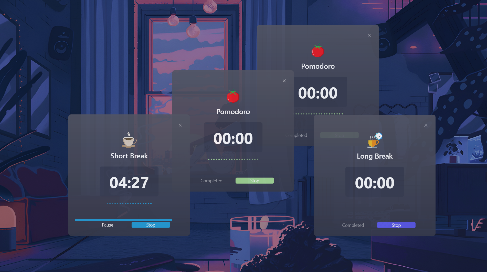

# 🍅 PowerToys Run: Pomodoro Plugin

<div align="center">
  
  
  <p align="center">
    
  </p>
  
  <h1>⏱️ Pomodoro for PowerToys Run ⏱️</h1>
  <h3>Manage your productivity sessions directly from PowerToys Run</h3>

  
  
  
  [](https://opensource.org/licenses/MIT)
  
  
  
  
  [](https://github.com/ruslanlap/PowerToysRun-Pomodoro/stargazers)
  [](https://github.com/ruslanlap/PowerToysRun-Pomodoro/issues)
  [](https://github.com/ruslanlap/PowerToysRun-Pomodoro/releases/latest)
  [](https://github.com/ruslanlap/PowerToysRun-Pomodoro/releases)
  
  
</div>

<div align="center">
  <a href="https://github.com/ruslanlap/PowerToysRun-Pomodoro/releases/download/v1.0.0/Pomodoro-x64.zip">
    
  </a>
  <a href="https://github.com/ruslanlap/PowerToysRun-Pomodoro/releases/download/v1.0.0/Pomodoro-ARM64.zip">
    
  </a>
</div>

## 📋 Table of Contents

- [📋 Overview](#-overview)
- [⚡ Easy Install](#-easy-install)
- [✨ Features](#-features)
- [🎬 Demo Gallery](#-demo-gallery)
- [🚀 Installation](#-installation)
- [🔧 Usage](#-usage)
- [📁 Data Storage](#-data-storage)
- [🛠️ Building from Source](#️-building-from-source)
- [📊 Project Structure](#-project-structure)
- [🤝 Contributing](#-contributing)
- [❓ FAQ](#-faq)
- [✨ Why You'll Love Pomodoro Plugin](#-why-youll-love-pomodoro-plugin)
- [📄 License](#-license)
- [🙏 Acknowledgements](#-acknowledgements)
- [🛠️ Implementation Details](#-implementation-details)
- [🚶‍♂️ My Pomodoro Journey](#-my-pomodoro-journey)

## 📋 Overview

Pomodoro is a plugin for [Microsoft PowerToys Run](https://github.com/microsoft/PowerToys) that brings the popular Pomodoro Technique to your keyboard. Simply type `pomodoro` followed by a command like `start`, `pause`, or `status` to manage your productivity sessions directly from your PowerToys Run interface.


## ⚡ Easy Install

<div align="">
  <a href="https://github.com/ruslanlap/PowerToysRun-Pomodoro/releases/download/v1.0.0/Pomodoro-x64.zip">
    
  </a>
  
  <p>
    <b>Quick Installation Steps:</b><br>
    1. Download using the button above<br>
    2. Extract to <code>%LOCALAPPDATA%\Microsoft\PowerToys\PowerToys Run\Plugins\</code><br>
    3. Restart PowerToys<br>
    4. Start using with <code>Alt+Space</code> then type <code>pomodoro</code>
  </p>
</div>

## ✨ Features

- ⏱️ **Start, Pause, and Reset Pomodoro Sessions** - Manage your work sessions with simple commands
- 🍅 **Visual Countdown** - See time remaining in your current session
- 🔔 **End-of-Session Alerts** - Get notified when your session ends with sound or visual cues
- 📊 **Session Tracking** - Keep track of completed Pomodoro sessions
- 🌙 **Break Management** - Automatically switch between work sessions and breaks
- ⚙️ **Configurable Session Length** - Customize work and break durations to fit your workflow
- 🔁 **Daily Productivity History** - View your productivity patterns over time

## 🎬 Demo Gallery

<div align="center">
  <h3>🍅 Start a Pomodoro Session</h3>
  <p></p>
  <p><i>Simply type <code>pomodoro start</code> to begin a focused work session</i></p>
  
</div>

## 🚀 Installation

### 📋 Prerequisites

- [Microsoft PowerToys](https://github.com/microsoft/PowerToys/releases) installed
- Windows 10 or later

### 📥 Installation Steps

1. Download the latest release from the [Releases page](https://github.com/ruslanlap/PowerToysRun-Pomodoro/releases/latest)
2. Extract the ZIP file to:
   ```
   %LOCALAPPDATA%\Microsoft\PowerToys\PowerToys Run\Plugins\
   ```
3. Restart PowerToys
4. Open PowerToys Run and type `pomodoro` to access the plugin

<div align="center">
  <a href="https://github.com/ruslanlap/PowerToysRun-Pomodoro/releases/latest">
    
  </a>
</div>

## 🔧 Usage

1. Open PowerToys Run (default: <kbd>Alt</kbd> + <kbd>Space</kbd>)
2. Use the following commands:

<div align="center">

| Command | Description | Example |
|---------|-------------|---------|
| `pomodoro` | Show Pomodoro instructions | `pomodoro` |
| `pomodoro start` | Start a new Pomodoro session | `pomodoro start` |
| `pomodoro pause` | Pause the current timer | `pomodoro pause` |
| `pomodoro resume` | Resume a paused timer | `pomodoro resume` |
| `pomodoro stop` | Stop and reset the timer | `pomodoro stop` |
| `pomodoro status` | Show remaining time and state | `pomodoro status` |
| `pomodoro break` | Start a short break | `pomodoro break` |
| `pomodoro longbreak` | Start a long break | `pomodoro longbreak` |

</div>

### 🎯 Quick Tips

- Press <kbd>Enter</kbd> on a command to execute it
- Right-click on a command for additional options
- Customize plugin settings in PowerToys Settings
- Long breaks automatically trigger after a configurable number of completed Pomodoros

## 📁 Data Storage

The Pomodoro plugin stores the following settings locally:

- Session length preferences (Pomodoro, short break, long break)
- Sound notification preference (enabled/disabled)
- Auto-start next session preference (enabled/disabled)
- Completed session history and statistics

All settings are stored securely in the PowerToys settings file.

## 🛠️ Building from Source

1. Clone the repository:
   ```
   git clone https://github.com/ruslanlap/PowerToysRun-Pomodoro.git
   ```

2. Open the solution in Visual Studio 2022 or later

3. Build the solution:
   ```
   dotnet build Pomodoro/Pomodoro.sln
   ```

4. Run the build-and-zip script to create installation packages:
   ```
   ./build-and-zip.sh
   ```

## 📊 Project Structure

```
Pomodoro/
├── Community.PowerToys.Run.Plugin.Pomodoro/
│   ├── Images/                  # Plugin icons and animations
│   ├── Sounds/                  # Sound effects
│   ├── Main.cs                  # Main plugin logic
│   ├── PomodoroResultWindow.xaml # Pomodoro timer window
│   ├── plugin.json             # Plugin metadata
│   └── ...
├── Services/
│   ├── TickCounterApiService.cs # Timer service
│   ├── SoundService.cs          # Sound notification service
├── Models/
│   ├── PomodoroSession.cs       # Session data model
│   ├── PomodoroSettings.cs      # Settings data model
└── Pomodoro.sln                # Solution file
```

## 🤝 Contributing

Contributions are welcome! Here's how you can help:

1. Fork the repository
2. Create a feature branch: `git checkout -b feature/amazing-feature`
3. Commit your changes: `git commit -m 'Add amazing feature'`
4. Push to the branch: `git push origin feature/amazing-feature`
5. Open a Pull Request

Please make sure to update tests as appropriate.

### Contributors

- [ruslanlap](https://github.com/ruslanlap) - Project creator and maintainer

## ❓ FAQ

<details>
<summary><b>How do I customize the Pomodoro session length?</b></summary>
<p>Open PowerToys Settings, navigate to PowerToys Run > Plugins > Pomodoro, and adjust the "Pomodoro length (minutes)" setting.</p>
</details>

<details>
<summary><b>Can I disable sound notifications?</b></summary>
<p>Yes, open PowerToys Settings, navigate to PowerToys Run > Plugins > Pomodoro, and toggle the "Play sound notifications" option.</p>
</details>

<details>
<summary><b>What happens when a Pomodoro session ends?</b></summary>
<p>By default, you'll receive a notification. If you've enabled "Auto-start next phase," the plugin will automatically start a short break after a work session, or a work session after a break.</p>
</details>

<details>
<summary><b>How many Pomodoros before a long break?</b></summary>
<p>By default, a long break occurs after 4 completed Pomodoro sessions. This can be customized in the settings.</p>
</details>

<details>
<summary><b>Can I view my productivity history?</b></summary>
<p>Yes, this feature is available in the plugin. Your completed sessions are tracked and can be viewed through the plugin interface.</p>
</details>

## ✨ Why You'll Love Pomodoro Plugin

- **Helps Maintain Focus**: Structure your work with dedicated focus periods
- **Encourages Healthy Break Patterns**: Reminds you to take regular breaks
- **Tracks Daily Performance**: Monitor your productivity patterns
- **Keyboard-Centric**: Perfect for keyboard power users
- **Customizable**: Set your preferred session lengths and notification settings
- **Fast**: Instant access to timer controls
- **Beautiful**: Clean, modern UI that matches PowerToys style
- **Resource-Efficient**: Lightweight with minimal system impact

## 📄 License

This project is licensed under the MIT License - see the [LICENSE](LICENSE) file for details.

## 🙏 Acknowledgements

- [Microsoft PowerToys](https://github.com/microsoft/PowerToys) team for the amazing launcher
- All contributors who have helped improve this plugin
- The Pomodoro Technique® by Francesco Cirillo for the time management method

## 🛠️ Implementation Details

The Pomodoro plugin is built using:

- C# and .NET
- WPF for the UI components
- System.Timers.Timer for countdown functionality
- Windows notification API for alerts
- Task-based asynchronous pattern for non-blocking operations

The plugin implements several PowerToys Run interfaces:
- `IPlugin` - Core plugin functionality
- `IDelayedExecutionPlugin` - Support for delayed execution
- `IContextMenu` - Right-click context menu
- `IDisposable` - Resource cleanup
- `ISettingProvider` - Settings management

### Roadmap

- [ ] Custom notification sounds
- [ ] Weekly productivity analytics
- [ ] Task labeling for Pomodoro sessions

### 🚶‍♂️ My Pomodoro Journey

I created this plugin because the Pomodoro Technique transformed my own productivity. As a developer juggling multiple projects, I found myself constantly distracted and struggling to maintain focus for extended periods. That's when I discovered the power of structured work intervals.

The problem? I needed a tool that integrated seamlessly with my workflow - no separate apps to launch or browser tabs to keep open. PowerToys Run was already part of my daily routine, so building a Pomodoro plugin felt like the perfect solution.

This plugin represents hundreds of hours of focused work (ironically, managed using the Pomodoro Technique itself!). It's designed by a developer, for developers, with the features I personally needed to stay productive:

- **Zero Friction**: Two keystrokes (Alt+Space) and I'm managing my time
- **Minimal Interruption**: Notifications that don't break concentration
- **Rhythm Building**: The consistent work/break pattern helped me develop better focus habits

I hope this plugin helps you as much as the technique has helped me. Happy focusing! 🍅

With love from [ruslanlap](https://github.com/ruslanlap) 🌟
